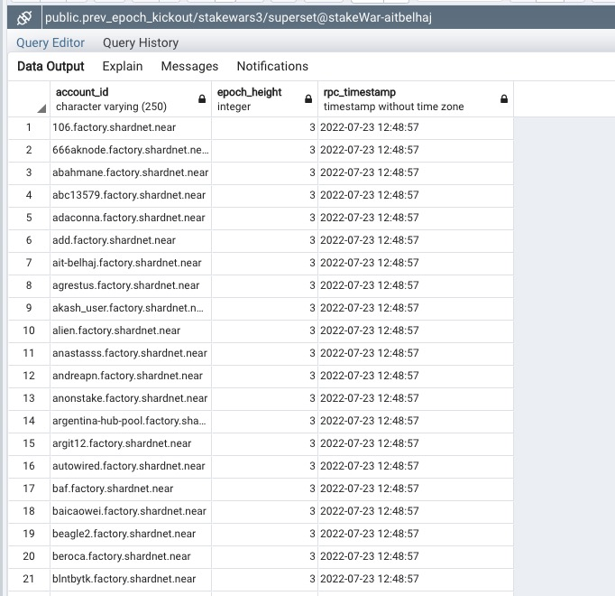

In this challenge, we are going to produce some charts using the data from the shardnet network.

We are going to use RPC call to fetch datas frequently so the charts are updated frequently.

We will use [Apache superSet](https://superset.apache.org/) as data exploration and visualization tool. 

## Install Apache superSet
 
  Clone Superset's repo 
 
  ```bash
  git clone https://github.com/apache/superset.git
  ```
 
 Navigate to to the folder created:  
 
```bash
 cd superset
```
 
Run the following command 
  
 ```bash 
sudo docker-compose -f docker-compose-non-dev.yml pull
```

Edit docker-compose-non-dev.yml
 
 ```bash 
 vim docker-compose-non-dev.yml
 ```
  
  in order to expose postgresql port 5432,  add this to the db section :
  
  ```bash
  ports:
    - "5432:5432"
  ```
  
  Start superset in as a backgroud process:

```bash
sudo docker-compose -f docker-compose-non-dev.yml up -d
```


## Create postgresql BI Tables

We will use postgresql to creates table that Apache superSet will use to explore 


Connect to postgresql 

```bash
sudo docker exec -it superset_db bash

psql -U superset

```

Create a database for our challenge 

```bash
CREATE DATABASE stakewars3;
```
Connect to  the database 

```bash
\c stakewars3;
```

Create 2 tables for our challenge : current_validators and prev_epoch_kickout.

```bash
CREATE TABLE current_validators(
  account_id VARCHAR ( 250 ) NOT NULL,
	public_key VARCHAR ( 255 )  NOT NULL,
	is_slashed BOOLEAN  NOT NULL,
	num_expected_blocks INT NOT NULL,
	num_produced_blocks INT NOT NULL,
	num_expected_chunks INT NOT NULL,
	num_produced_chunks INT NOT NULL,
	shards  INT  NOT NULL,
	stake decimal   NOT NULL,
	epoch_height INT  NOT NULL,
	rpc_timestamp TIMESTAMP NOT NULL
);
```


```bash
CREATE TABLE prev_epoch_kickout(
  account_id VARCHAR ( 250 ) NOT NULL,
  epoch_height INT  NOT NULL,
  rpc_timestamp TIMESTAMP NOT NULL
);

```


We are going to populate these two tables using a node js script that does calls  to RPC endpiont every epoch.

## Create a Node JS appli to populate the tables


  *  install  nodejs modules pg and request
  
  
  ```bash
   npm install pg
   npm install request
   
  ```
  
  
  * Create a script to  perdiodically load data from RPC call.
  
  ```bash
  sudo vim loadDatas.js   
  ```
  
  The source can be found here :  https://github.com/abahmanem/near-node-setup-shardnet/blob/main/challenge-7/loadDatas.js
  
  * Run the script : 
  
  ```bash
  sudo node loadDatas.js   
  ```
  
  Check data has been loaded into the 2 tables : 
  
  
  <br/><br/>
   
  <br/><br/>
   
  <br/><br/>
  
  
  
  
  ## Create Charts in Apache SuperSet
  
  Login to Apache SuperSet (admin/admin):
  
    <br/><br/>
   
  <br/><br/>
  
  
  * Add a database
  Add teh database previously created :
  
      <br/><br/>
   
  <br/><br/>
  
  Once done, it should appear in the list of databases
      <br/><br/>
   
  <br/><br/>
  
  * Add datasets
  
  Add two dataset : one for  current_validators and one for prev_epoch_kickout
  
  <br/><br/>
   
  <br/><br/>
  
  
  * Create a Dashboard
  
  Add a dashboard to put in our charts
  
  <br/><br/>
   
  <br/><br/>
  
    
  
  * Add charts 
  
  1- Lets add a chart representing the average stake per validator at a given time :
  
  For this chart, we are going to use a Pie chart and the table current_validators to collect datas:
  
  <br/><br/>
   
  <br/><br/>
  
  
  then in the following page:
  
  - put **account_id** in dimentions
  
  - for Metrics : select **stake** field and **AVG** function
  


 <br/><br/>
   
  <br/><br/>

  Click Save
  
 The chart will then be created and updated accordingly :
 
  
  <br/><br/>
   
  <br/><br/>
  
  
  Save the chart to the dashboad :
 
  <br/><br/>
   
  <br/><br/>
  
 The chart is now published and it can be accessed on line :
 
 
  <br/><br/>
   
  <br/><br/>
  
  The chart will update continously as new data are injected in the database.
  We can also add filter to the online chart.
 
 
 ### Thoughts on STAKE_DISTRIBUTION_DECENTRALIZATION chart
 
 This chart shows that one of the trilemas that the POS blockchain tries to solve is broken:Decentralization.
    
 A few nodes have more than 80% of the total stake.
    
 If they go offline at the same time, the network may broke and this is not healthy for the netowrk.
    
 Recommendations :
    
 * Cap the total stake per node if faisible.
 
 * Cap the number of delegators per node (at least temporarilly) : no more than 1000 delegator per node, an error message can be thrown when a 		delegator tries to delegate to a node that has reached the treshold of 1000 delegators.
    
 * Onboard more nodes in the netword. Lower the price seat.
    
 * The Near team or the foundation managing the Near tokens can stake more on the smallest nodes to promote decentralization.

 * For the 200-300 nodes that will be added to network as per StakeWars 3 phase, promote and advertize these nodes.  

 
     
     
    
