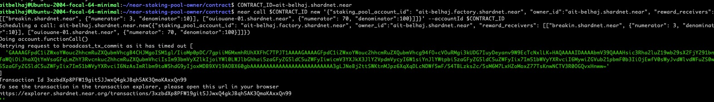

In this challenge, we are going to  deploy a smart contract on the owner account of our staking pool.

This contract will allow users to split their rewards on multiple accounts.


* Install cargo and Rust in case you don't have it

´´´bash
curl --proto '=https' --tlsv1.2 https://sh.rustup.rs -sSf | sh

source $HOME/.cargo/env
```


* Add the wasm32-unknown-unknown toolchain

´´´bash
rustup target add wasm32-unknown-unknown
´´´

* Clone the project : near-staking-pool-owner

´´´bash
git clone https://github.com/zavodil/near-staking-pool-owner
´´´

* Compile smart contract

´´´bash
cd near-staking-pool-owner/contract
rustup target add wasm32-unknown-unknown
cargo build --target wasm32-unknown-unknown --release
´´´


* Deploy smart contract on our owner account.
´´´bash
NEAR_ENV=shardnet near deploy ait-belhaj.shardnet.near --wasmFile target/wasm32-unknown-unknown/release/contract.wasm
´´´

This will result in the following output

 <br/><br/>

   
<br/><br/

* Initialize the smart contract picking accounts for splitting revenue.


´´´bash
CONTRACT_ID=ait-belhaj.shardnet.near

# Change numerator and denomitor to adjust the % for split.
near call $CONTRACT_ID new '{"staking_pool_account_id": "ait-belhaj.factory.shardnet.near", "owner_id":"ait-belhaj.shardnet.near", "reward_receivers": [["breakin.shardnet.near", {"numerator": 3, "denominator":10}], ["ouiouane-01.shardnet.near", {"numerator": 70, "denominator":100}]]}' --accountId $CONTRACT_ID
´´´bash

We are splitting rewards :

- 70% to account ouiouane-01.shardnet.near
- 30% to account breakin.shardnet.near


 <br/><br/>

   
<br/><br/


* We wait until we start receiving rewards on your node staking pool then we will withdraw them to our account.


´´´bash
CONTRACT_ID=ait-belhaj.shardnet.near
NEAR_ENV=shardnet near call $CONTRACT_ID withdraw '{}' --accountId $CONTRACT_ID --gas 200000000000000
´´´


