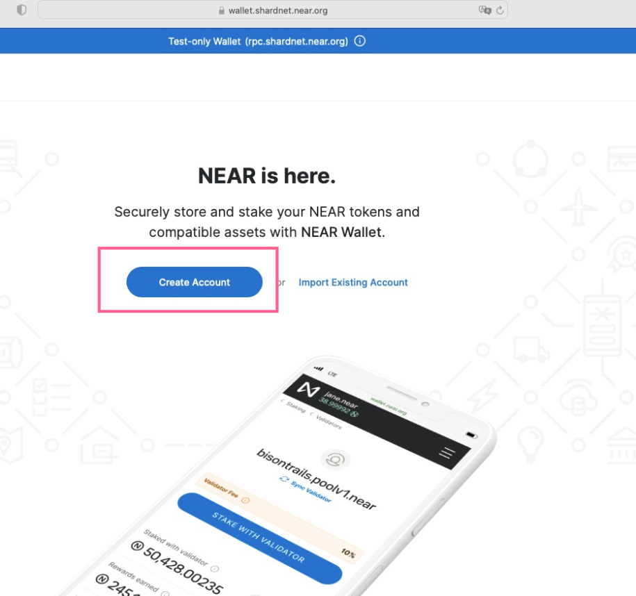
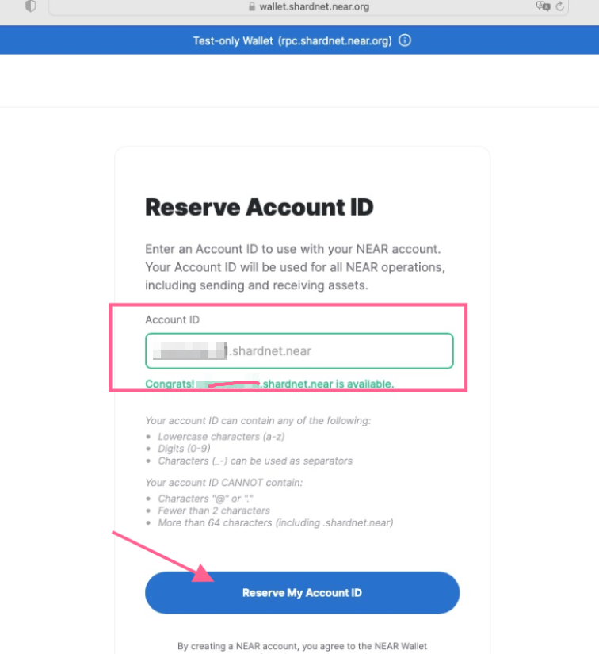
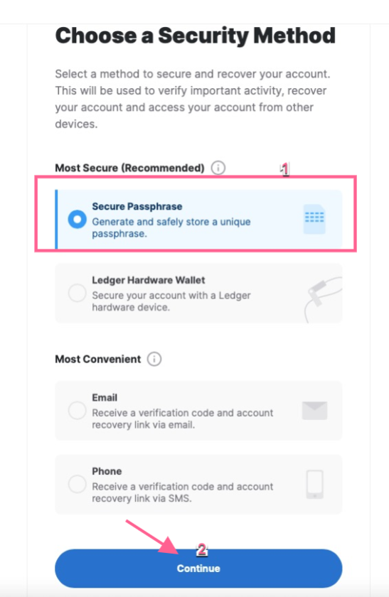
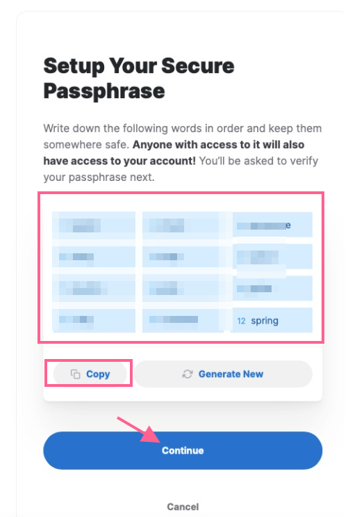
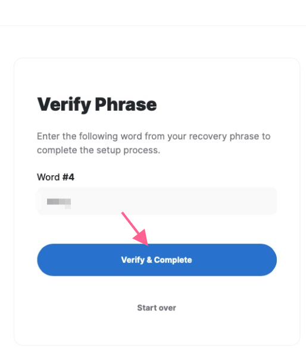
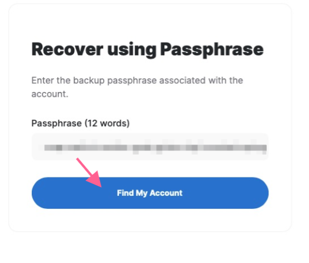
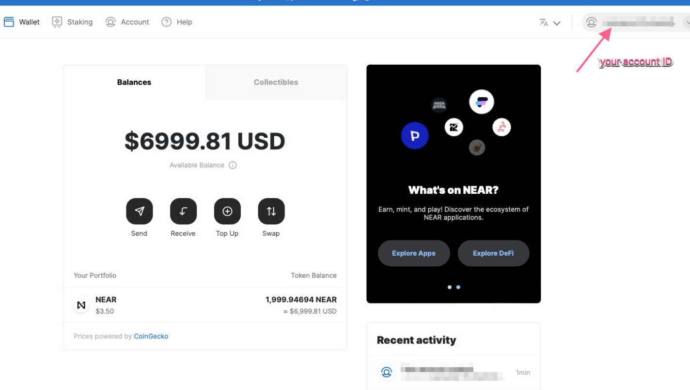

## Create your Shardnet wallet

In this section, we will learn how to create a Shardnet wallet

  1- Navigate to  https://wallet.shardnet.near.org and press Create account

   

  
  2-In the next page, Enter your Account-ID and press 'Reserve my Account-ID'
  
   

  
  3- Choose a security method, 'Secure paraphrase' is the safest and the recommended one
  
   
  
  
  4-Set up you security paraphrase (seed), you should keep it for yourself and never share it. Copy the paraphrase. 
      You will be asked to verify it ine the next step
      
   
  
  
  5- You are asked to verify a given work from your secure paraphrase, enter it and press verify and complete
  
   

  
  6-Now , you are asked to verify the whole 12 work of teh paraphrase, enter them all and press Find my Account
  
   

  
  7-Congratulations, your account has been created.You can see your Account-ID in the top right corner of the browser
  
   
 
 
 
