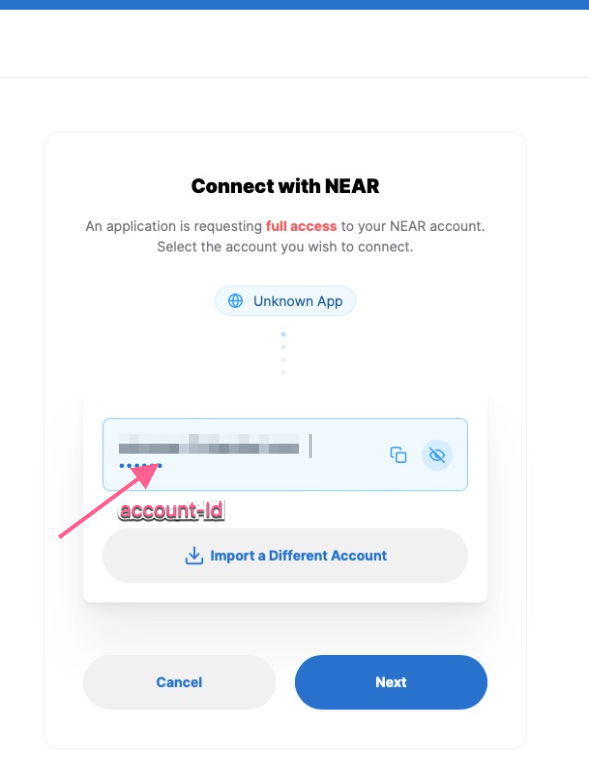
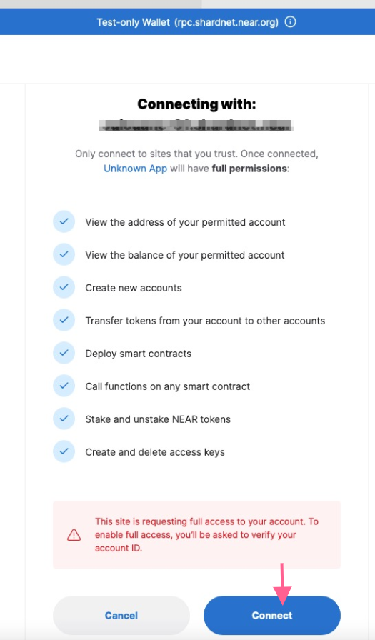

In the following sections, **It's recommended** to run the commands  as a non-root user
 
 # Setup a non-root user

    
   * Login as root and create a user and set a password
   
   ```bash
   root@Ubuntu-2004-focal-64-minimal ~ # sudo adduser abahmane
   Adding user `abahmane' ...
   Adding new group `abahmane' (1000) ...
   Adding new user `abahmane' (1000) with group `abahmane' ...
   Creating home directory `/home/abahmane' ...
   Copying files from `/etc/skel' ...
   New password:
   Retype new password:
   ```
   
   * Add the user to the sudoers (nano or vim)
   
   ```bash
   root@Ubuntu-2004-focal-64-minimal ~ # EDITOR=vim visudo  
   ```
   * Scroll down next to the line :
   ```bash
    root    ALL=(ALL:ALL) ALL
   ```
   * Add the line :

   ```bash
   abahmane  ALL=(ALL) NOPASSWD:ALL
   ```
   * Save a file and quit the editor.

  quit the root session and login back using the urername you have just created.

# Deploy the node

  ## setup NEAR-CLI

   * Sync and install the newest versions of all installed packages on the linux machine

   ```bash
   abahmane@Ubuntu-2004-focal-64-minimal:~$ sudo apt update && sudo apt upgrade -y
   ```

    * Install Node.js and npm

   ```bash
   curl -sL https://deb.nodesource.com/setup_18.x | sudo -E bash -  
   sudo apt install build-essential nodejs
   PATH="$PATH"
   ```

   * Check Node.js and npm versions:
   
  ```bash
  abahmane@Ubuntu-2004-focal-64-minimal:~$ node -v
  v18.6.0
  ```

   ```bash
  abahmane@Ubuntu-2004-focal-64-minimal:~$ npm -v
  8.13.2   
  ```

  * Update npm to 8.14.0

  ```bash
   abahmane@Ubuntu-2004-focal-64-minimal:~$sudo npm install -g npm@8.14.0
 ```
 
   * Install NEAR-CLI
   
  ```bash
   abahmane@Ubuntu-2004-focal-64-minimal:~$ sudo npm install -g near-cli
  ```

   * Set Network to Shardnet, in order to make it persistent, add it to ~/.bashrc.
  
  ```bash
  abahmane@Ubuntu-2004-focal-64-minimal:~$ echo 'export NEAR_ENV=shardnet' >> ~/.bashrc
  ```
  
  Near-Cli is now installed, you can check by running the following commands for example:
   
   
  ```bash
  abahmane@Ubuntu-2004-focal-64-minimal:~$ near validators current 
  ```   
   
  Thsi command lists the current validators set :  
    

  


### Setup node 

  #### Install dependencies and set the configuration
    
  * First, check that you have the required hardware specifications to run a node 

  ```bash
  abahmane@Ubuntu-2004-focal-64-minimal:~$ lscpu | grep -P '(?=.*avx )(?=.*sse4.2 )(?=.*cx16 )(?=.*popcnt )' > /dev/null \
  >   && echo "Supported" \
  >   || echo "Not supported"
  Supported
  ```
  * Install developer tools: 

   ```bash
  abahmane@Ubuntu-2004-focal-64-minimal:~$ sudo apt install -y git binutils-dev libcurl4-openssl-dev zlib1g-dev libdw-dev libiberty-dev cmake gcc g++ python docker.io protobuf-compiler libssl-dev pkg-config clang llvm cargo
  ```
  * Install Python pip

  ```bash
  abahmane@Ubuntu-2004-focal-64-minimal:~$ sudo apt install python3-pip
  ```

  * Set the configuration 

  ```bash
  abahmane@Ubuntu-2004-focal-64-minimal:~$ USER_BASE_BIN=$(python3 -m site --user-base)/bin
  abahmane@Ubuntu-2004-focal-64-minimal:~$ export PATH="$USER_BASE_BIN:$PATH"

  ```
  * Install Building env
  
  ```bash
  abahmane@Ubuntu-2004-focal-64-minimal:~$ sudo apt install clang build-essential make
  ```

  * Install Rust & Cargo

  ```bash
  abahmane@Ubuntu-2004-focal-64-minimal:~$ curl --proto '=https' --tlsv1.2 -sSf https://sh.rustup.rs | sh
  ```

   you will see the following output , press 1 and press enter :

 ```bash
  1) Proceed with installation (default)
  2) Customize installation
  3) Cancel installation
  >1

  info: profile set to 'default'
  info: default host triple is x86_64-unknown-linux-gnu
  info: syncing channel updates for 'stable-x86_64-unknown-linux-gnu'
  info: latest update on 2022-06-30, rust version 1.62.0 (a8314ef7d 2022-06-27)
  info: downloading component 'cargo'
  info: downloading component 'clippy'
  info: downloading component 'rust-docs'
  info: downloading component 'rust-std'
  info: downloading component 'rustc'
  info: downloading component 'rustfmt'
  info: installing component 'cargo'
  info: installing component 'clippy'
  info: installing component 'rust-docs'
  18.3 MiB /  18.3 MiB (100 %)  13.9 MiB/s in  1s ETA:  0s
  info: installing component 'rust-std'
  26.0 MiB /  26.0 MiB (100 %)  16.5 MiB/s in  1s ETA:  0s
  info: installing component 'rustc'
  54.1 MiB /  54.1 MiB (100 %)  19.1 MiB/s in  2s ETA:  0s
  info: installing component 'rustfmt'
  info: default toolchain set to 'stable-x86_64-unknown-linux-gnu'

  stable-x86_64-unknown-linux-gnu installed - rustc 1.62.0 (a8314ef7d 2022-06-27)
  Rust is installed now. Great!

  To get started you may need to restart your current shell.
  This would reload your PATH environment variable to include
  Cargo's bin directory ($HOME/.cargo/bin).

  To configure your current shell, run:
  source "$HOME/.cargo/env"
  ```

  * Source the environment
  
  ```bash
  abahmane@Ubuntu-2004-focal-64-minimal:~$ source $HOME/.cargo/env
  ``` 

  * Clone nearcore project from GitHub : 
  
  ```bash
  abahmane@Ubuntu-2004-focal-64-minimal:~$ git clone https://github.com/near/nearcore
   ```  
   then 
   
   ```bash
   abahmane@Ubuntu-2004-focal-64-minimal:~$ cd nearcore
   abahmane@Ubuntu-2004-focal-64-minimal:~/nearcore$ git fetch
   ``` 
    
  checkout to the master branch 
   
   ```bash
   abahmane@Ubuntu-2004-focal-64-minimal:~/nearcore$ git checkout master
   Already on 'master'
   Your branch is up to date with 'origin/master'.
   ``` 
   Compile nearcore binary, run the following commands in the nearcore folder :
  
   ```bash
   abahmane@Ubuntu-2004-focal-64-minimal:~/nearcore$ cargo build -p neard --release --features shardnet
   ``` 
   The binary path is set to target/release/neard  

   * Initialize working directory
   
   Generate the initial required working directory and a couple of configuration files:

    - config.json : contains needed information for a node to run on the network, how to communicate with peers, and how to reach consensus
    - genesis.json : contains initial accounts, contracts, access keys, and other records which represents the initial state of the blockchain
    - node_key.json : contains a public and private key for the node. Also includes an optional account_id parameter which is required to run a  
    validator node.
    - data/ : Near node state.
  
   Run the following command to generate working directory 

   ```bash
   abahmane@Ubuntu-2004-focal-64-minimal:~/nearcore$./target/release/neard --home ~/.near init --chain-id shardnet --download-genesis 
   ```
   produces the following output :
   ```bash
    2022-07-14T17:20:26.243764Z  INFO neard: version="trunk" build="crates-0.14.0-216-g96f13d239" latest_protocol=100
    2022-07-14T17:20:26.244006Z  INFO near: Using key ed25519:14Pbi1rtMo4s9PqxfxB3mLxz4FQdKQaDVm1KYKU7sT1S for node
    2022-07-14T17:20:26.244057Z  INFO near: Downloading genesis file from: https://s3-us-west-1.amazonaws.com/build.nearprotocol.com/nearcore-deploy/shardnet/genesis.json.xz ...
    [00:00:00] [####################################################################################################################################################################################] 1.11KB/1.11KB [5.82MB/s] (0s)
    2022-07-14T17:20:27.068464Z  INFO near: Saved the genesis file to: /home/abahmane/.near/genesis.json ...
    2022-07-14T17:20:27.082573Z  INFO near: Generated for shardnet network node key and genesis file in /home/abahmane/.near
   ```

   * Replace the config.json
   
   In config.json, change these two parameters : **boot_nodes** and **tracked_shards**

   ````bash
   abahmane@Ubuntu-2004-focal-64-minimal:~/nearcore$ rm ~/.near/config.json
   abahmane@Ubuntu-2004-focal-64-minimal:~/nearcore$ wget -O ~/.near/config.json https://s3-us-west-1.amazonaws.com/build.nearprotocol.com/nearcore-
    deploy/shardnet/config.json
   --2022-07-14 21:22:48--  https://s3-us-west-1.amazonaws.com/build.nearprotocol.com/nearcore-deploy/shardnet/config.json
   Resolving s3-us-west-1.amazonaws.com (s3-us-west-1.amazonaws.com)... 52.219.116.232
   Connecting to s3-us-west-1.amazonaws.com (s3-us-west-1.amazonaws.com)|52.219.116.232|:443... connected.
   HTTP request sent, awaiting response... 200 OK
   Length: 3647 (3.6K) [application/json]
   Saving to: ‘/home/abahmane/.near/config.json’

   /home/abahmane/.near/config.json                         100%[===============================================================================================================================>]   3.56K  --.-KB/s    in 0s

   2022-07-14 21:22:49 (112 MB/s) - ‘/home/abahmane/.near/config.json’ saved [3647/3647]
   ````

  * Get the latest state snapshot 

  Install aws Cli
  
  ````bash
  abahmane@Ubuntu-2004-focal-64-minimal:~/nearcore$ sudo apt-get install awscli -y
  ````
  Then
  
  ````bash
  abahmane@Ubuntu-2004-focal-64-minimal:~/nearcore$ cd ~/.near
  abahmane@Ubuntu-2004-focal-64-minimal:~/.near$ aws s3 --no-sign-request cp s3://build.openshards.io/stakewars/shardnet/data.tar.gz .
  tar -xzvf data.tar.gz
   ````

  * Run the node
  
  You can start your node by  running the following command under nearcore folder:
  ````bash
  abahmane@Ubuntu-2004-focal-64-minimal:~/nearcore$./target/release/neard --home ~/.near run
  ````
  The command produces the following output:
  
  ````bash
  abahmane@Ubuntu-2004-focal-64-minimal:~/nearcore$ sudo ./target/release/neard --home ~/.near run
  2022-07-14T21:29:49.419836Z  INFO neard: version="trunk" build="crates-0.14.0-216-g96f13d239" latest_protocol=100
  2022-07-14T21:29:49.427357Z  INFO db: Created a new RocksDB instance. num_instances=1
  2022-07-14T21:29:49.424828Z  INFO db: Dropped a RocksDB instance. num_instances=0
  2022-07-14T21:29:49.427836Z  INFO near: Opening RocksDB database path=/home/abahmane/.near/data
  2022-07-14T21:29:49.494753Z  INFO db: Created a new RocksDB instance. num_instances=1
  2022-07-14T21:29:49.512921Z  INFO near_network::peer_manager::peer_manager_actor: Bandwidth stats total_bandwidth_used_by_all_peers=0 total_msg_received_count=0 max_max_record_num_messages_in_progress=0
  2022-07-14T21:29:49.520805Z  INFO stats: #  941069 Waiting for peers 0 peers ⬇ 0 B/s ⬆ 0 B/s 0.00 bps 0 gas/s CPU: 0%, Mem: 60.1 MB
  2022-07-14T21:29:49.520858Z DEBUG stats: EpochId(`Bz9n5HbzLd5Bmsuoc15xbKkJnuuMgNJm8YYb2qMngT2E`) Blocks in progress: 0 Chunks in progress: 0 Orphans: 0
  2022-07-14T21:29:49.521893Z  INFO stats: #  941069 Waiting for peers 0 peers ⬇ 0 B/s ⬆ 0 B/s 0.00 bps 0 gas/s CPU: 92%, Mem: 155 MB
  2022-07-14T21:29:49.521944Z DEBUG stats: EpochId(`Bz9n5HbzLd5Bmsuoc15xbKkJnuuMgNJm8YYb2qMngT2E`) Blocks in progress: 0 Chunks in progress: 0 Orphans: 0
  2022-07-15T21:29:49.522780Z  INFO stats: #  941069 Downloading headers 1.73% (29355 left; at 941585) 5 peers ⬇ 109 kB/s ⬆ 109 kB/s 0.00 bps 0 gas/s CPU: 51%, Mem: 278 MB
  2022-07-14T21:29:49.522832Z DEBUG stats: EpochId(`Bz9n5HbzLd5Bmsuoc15xbKkJnuuMgNJm8YYb2qMngT2E`) Blocks in progress: 0 Chunks in progress: 0 Orphans: 0
  2022-07-14T21:29:50.148486Z  INFO stats: #  941069 Downloading headers 3.45% (28843 left; at 942101) 7 peers ⬇ 349 kB/s ⬆ 328 kB/s 0.00 bps 0 gas/s CPU: 52%, Mem: 318 MB
  2022-07-14T21:29:50.148520Z DEBUG stats: EpochId(`Bz9n5HbzLd5Bmsuoc15xbKkJnuuMgNJm8YYb2qMngT2E`) Blocks in progress: 0 Chunks in progress: 0 Orphans: 0
  2022-07-15T21:29:50.476642Z  INFO stats: #  941069 Downloading headers 6.90% (27821 left; at 943131) 8 peers ⬇ 596 kB/s ⬆ 493 kB/s 0.00 bps 0 gas/s CPU: 48%, Mem: 291 MB
  2022-07-14T21:29:50.476676Z DEBUG stats: EpochId(`Bz9n5HbzLd5Bmsuoc15xbKkJnuuMgNJm8YYb2qMngT2E`) Blocks in progress: 0 Chunks in progress: 0 Orphans: 0
  2022-07-15T21:29:50.478761Z  INFO stats: #  941069 Downloading headers 12.09% (26284 left; at 944684) 9 peers ⬇ 780 kB/s ⬆ 551 kB/s 0.00 bps 0 gas/s CPU: 60%, Mem: 320 MB
  2022-07-14T21:29:50.478812Z DEBUG stats: EpochId(`Bz9n5HbzLd5Bmsuoc15xbKkJnuuMgNJm8YYb2qMngT2E`) Blocks in progress: 0 Chunks in progress: 0 Orphans: 0
  ````

  * Authorize Wallet Locally
  
  in order to run  transactions via NEAR-CLI, a full access key needs to be installed locally.

  Run the command : 
   
   ````bash
    abahmane@Ubuntu-2004-focal-64-minimal:~$ near login
   ````

  You will see the following outpu :

 ```bash
  Please help us to collect data on near-cli usage to improve developer experience.
  We will never send private information. We collect which commands are run with attributes, your account ID, and your country
  Note that your account ID and all associated on-chain transactions are already being recorded on public blockchain.

  Would you like to opt in (y/n)? y

  Please authorize NEAR CLI on at least one of your accounts.

  If your browser doesn't automatically open, please visit this URL
  https://wallet.shardnet.near.org/login/?referrer=NEAR+CLI&public_key=ed25519%3BNAATfja********************************s_url=http%3A%2F%2F127.0.0.1%3A5000
  Please authorize at least one account at the URL above.

  Which account did you authorize for use with NEAR CLI?
  Enter it here (if not redirected automatically):

  ```
  Copy the url and paste it to you browser and  Grant Access to Near CLI
  
   
  
   
    
 
  After granting access you will see this page:

   
  
  Enter your account-id and press Enter:

  ````bash
  Which account did you authorize for use with NEAR CLI?
  Enter it here (if not redirected automatically):
  abahmane.shardnet.near
  Logged in as [ abahmane.shardnet.near ] with public key [ ed25519:ATjazw... ] successfully
 ````

 * Check the validator_key.json
  
  Run the following command :

  ```bash
  abahmane@Ubuntu-2004-focal-64-minimal:~$ cat ~/.near/validator_key.json
  cat: /home/abahmane/.near/validator_key.json: No such file or directory
  ```
  If the file is not present, generate one like this :

   ```bash
    near generate-key <pool_id> , (pool_id = account-id = abahmane in our case)
   ```

  Copy the file generated to shardnet folder and be sure to replace <pool_id> by your accountId
   
   ```bash
   abahmane@Ubuntu-2004-focal-64-minimal:~$ cp ~/.near-credentials/shardnet/abahmane.json ~/.near/validator_key.json
   ```
   
   Edit ~/.near/validator_key.json file and change the following :

       1. “account_id” to xxxx.factory.shardnet.near, where xxxx is the Pool_Name (Pool_Name=abahmane in our case)
       2. private_key to secret_key
   
  
  * Start the node
  
  ```bash
   abahmane@Ubuntu-2004-focal-64-minimal:~/nearcore$ target/release/neard run
   ```

  * Install the node Service 
 
   ```bash
    abahmane@Ubuntu-2004-focal-64-minimal:~/nearcore$ sudo vi /etc/systemd/system/neard.service
   ```
    
   **Copy and paste the following**
  
 ```bash   
   [Unit]
   Description=NEARd Daemon Service
   [Service]
   Type=simple
   User=<USER>
   #Group=near
   WorkingDirectory=/home/<USER>/.near
   ExecStart=/home/<USER>/nearcore/target/release/neard run
   Restart=on-failure
   RestartSec=30
   KillSignal=SIGINT
   TimeoutStopSec=45
   KillMode=mixed
   [Install]
   WantedBy=multi-user.target
  ```
  
  repalce **<USER>** by a non-root user (<USER>=abahmane in our case)

  * Enable neard service 

  ```bash
  abahmane@Ubuntu-2004-focal-64-minimal:~/nearcore$ sudo systemctl enable neard
  ```
  
  * Start the node
  
  ```bash 
  abahmane@Ubuntu-2004-focal-64-minimal:~/nearcore$ sudo systemctl start neard
  ```
   
 You can check the node logs by issuing the following command

  ```bash
  abahmane@Ubuntu-2004-focal-64-minimal:~/.near$ journalctl -n 100 -f -u neard
  ```
 
 Which will show the following output:
  
   
  
  
  You can install bundle 'ccze' to print pretty logs
 
  ```bash
  abahmane@Ubuntu-2004-focal-64-minimal:~/.near$ sudo apt install ccze
  ```
  Running the command
 
  ```bash
   abahmane@Ubuntu-2004-focal-64-minimal:~/.near$ journalctl -n 100 -f -u neard | ccze -A
  ```
  will print the following logs:

   

  <br/>
  
 [Next Step : Configuring a Staking pool](https://github.com/abahmanem/near-node-setup-shardnet/blob/main/tutorial/staking-pool.md)
 
  
  
