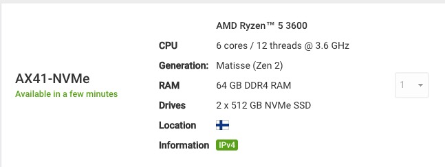

# Hardware

**[Stake Wars](https://medium.com/nearprotocol/join-stake-wars-to-become-a-chunk-only-producer-52cb67b19f19)** main objective is to set up validator nodes called Chunk-Only Producers whose main purpose is to produce [chunks](https://near.org/papers/nightshade/#nightshade) in a single shard (a network partition).

These validators can mount their nodes on machines with less constraining specifications compared to a full validating node [hardware requirement](https://near-nodes.io/validator/hardware) on the Near mainnet network.
For this guide, we are using a [Hetzner](https://hetzner.com) cloud server with the following specifications : 

  - Server AMD Ryzen™ 5 3600
  - CPU:  6 cores / 12 threads @ 3.6 GHz
  - 64 GB DDR4 RAM
  - 2 x 512 GB NVMe SSD (Raid1)
  - price : 36 euros/month

  
