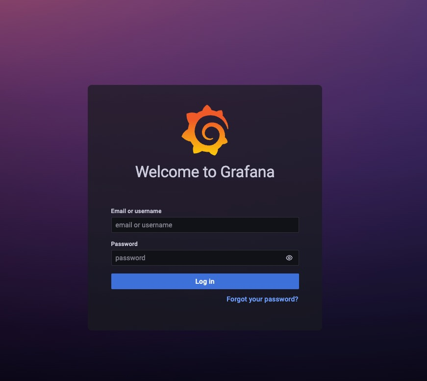
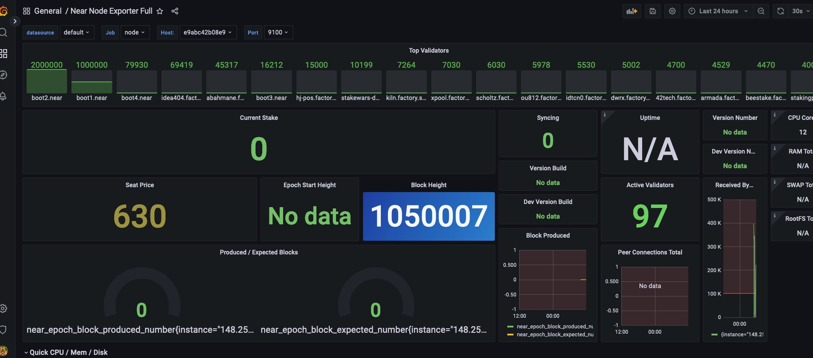

# Node monitoring

 * Checking the version of your node 

You can check the version of your node against the shardnet network version to see if you are up to date.
```bash
diff <(curl -s https://rpc.shardnet.near.org/status | jq .version) <(curl -s http://127.0.0.1:3030/status | jq .version)
```


 * Node service status
 
 you can check if your node is up and runing by runing the followng command:
 
 ```bash
 aitbelhaj@Ubuntu-2004-focal-64-minimal ~ # sudo systemctl status neard
 
 ```
 
 If the node is up, it will print the following 
 
 ```bash
 ● neard.service - NEARd Daemon Service
     Loaded: loaded (/etc/systemd/system/neard.service; enabled; vendor preset: enabled)
     Active: **active (running)** since Tue 2022-07-19 15:53:34 CEST; 6h ago
   Main PID: 2918447 (neard)
      Tasks: 85 (limit: 77021)
     Memory: 21.8G
     CGroup: /system.slice/neard.service
             └─2918447 /home/aitbelhaj/nearcore/target/release/neard run

Jul 19 22:04:41 Ubuntu-2004-focal-64-minimal neard[2918447]: 2022-07-19T20:04:41.462522Z  INFO stats: # 1015961 Gu6VuArUKFS3Mm7vNwcxjgSrmmgyn7V8AkP7qoE57iBR Validator | 97 validators 34 peers ⬇ 397 kB/s ⬆ 685 kB/s 0.60 bps 21.1 Tgas/s>
Jul 19 22:04:41 Ubuntu-2004-focal-64-minimal neard[2918447]: 2022-07-19T20:04:41.462848Z DEBUG stats: EpochId(`GiKXd3r5VQdxrvCKdcreSmQseYMD5fAbbS4fknnbnrgW`) Blocks in progress: 48 Chunks in progress: 0 Orphans: 0
Jul 19 22:04:51 Ubuntu-2004-focal-64-minimal neard[2918447]: 2022-07-19T20:04:51.463444Z  INFO stats: # 1015968 547RiG7qR5aQCJ4sf71f2FDTtRr5jmGNwdP8SZnbS9VE Validator | 97 validators 34 peers ⬇ 399 kB/s ⬆ 698 kB/s 0.70 bps 39.0 Tgas/s>
Jul 19 22:04:51 Ubuntu-2004-focal-64-minimal neard[2918447]: 2022-07-19T20:04:51.463759Z DEBUG stats: EpochId(`GiKXd3r5VQdxrvCKdcreSmQseYMD5fAbbS4fknnbnrgW`) Blocks in progress: 48 Chunks in progress: 0 Orphans: 0
Jul 19 22:05:01 Ubuntu-2004-focal-64-minimal neard[2918447]: 2022-07-19T20:05:01.464763Z  INFO stats: # 1015976 3JogYkQp9GJQuZo85LedJEQMhRBKHs7ELUUNbqs1oXgw Validator | 97 validators 34 peers ⬇ 388 kB/s ⬆ 677 kB/s 0.80 bps 38.7 Tgas/s>
Jul 19 22:05:01 Ubuntu-2004-focal-64-minimal neard[2918447]: 2022-07-19T20:05:01.465106Z DEBUG stats: EpochId(`GiKXd3r5VQdxrvCKdcreSmQseYMD5fAbbS4fknnbnrgW`) Blocks in progress: 48 Chunks in progress: 0 Orphans: 0
Jul 19 22:05:11 Ubuntu-2004-focal-64-minimal neard[2918447]: 2022-07-19T20:05:11.465567Z  INFO stats: # 1015983 GVkX1QHfjEdqSNnEwt85bJiL8Prhm4CTQ2dGzSW2iq7q Validator | 97 validators 34 peers ⬇ 403 kB/s ⬆ 694 kB/s 0.70 bps 38.3 Tgas/s>
Jul 19 22:05:11 Ubuntu-2004-focal-64-minimal neard[2918447]: 2022-07-19T20:05:11.465891Z DEBUG stats: EpochId(`GiKXd3r5VQdxrvCKdcreSmQseYMD5fAbbS4fknnbnrgW`) Blocks in progress: 48 Chunks in progress: 0 Orphans: 0
Jul 19 22:05:21 Ubuntu-2004-focal-64-minimal neard[2918447]: 2022-07-19T20:05:21.466860Z  INFO stats: # 1015991 HR1bvjYMEzGJhnBg6VYRVgLMUdbAbd8hKxFFb4XzQTxr Validator | 97 validators 34 peers ⬇ 402 kB/s ⬆ 716 kB/s 0.80 bps 31.6 Tgas/s>
Jul 19 22:05:21 Ubuntu-2004-focal-64-minimal neard[2918447]: 2022-07-19T20:05:21.467190Z DEBUG stats: EpochId(`GiKXd3r5VQdxrvCKdcreSmQseYMD5fAbbS4fknnbnrgW`) Blocks in progress: 48 Chunks in progress: 0 Orphans: 0
 
 ```
 
 
 * Check your node logs
 
 ```bash
 aitbelhaj@Ubuntu-2004-focal-64-minimal ~ # journalctl -n 100 -f -u neard | ccze -A
 ```
 
 Will show the following 
 <br/><br/>
   
  <br/><br/>
 


 
 ## Monitor using Near-cli
  
 * Check if Node is active (not slashed)
 
 You can **use near-cli** to see if your node is currently active
 
  * Get the next Epoch set of active validators:
 
 ```bash
  aitbelhaj@Ubuntu-2004-focal-64-minimal ~ # NEAR_ENV=shardnet  near validators next 
 ```
 
  <br/><br/>
 
 <br/><br/>
 
 * Get the current set of active validators:
 
 ```bash
  aitbelhaj@Ubuntu-2004-focal-64-minimal ~ # NEAR_ENV=shardnet  near validators current 
 ```
 
  <br/><br/>
 
 <br/><br/>
 
 * Check if yours is amongst them 
  
 ```bash
  aitbelhaj@Ubuntu-2004-focal-64-minimal ~ # NEAR_ENV=shardnet  near validators current | grep ait-belhaj.factory.shardnet.near
 ```
 
 If your node is not slashed, this command will print a line corresponding to your staking pool id :
 
 ```bash
 | ait-belhaj.factory.shardnet.near           | 1930   | 1       | 91.57%   |             100 |             127 |            1638 |            1771 |
 ```
 
  * Check your current stake

  You can use this command to check you total stake
  
   ```bash
  near validators current | awk '/<pool-id>/ {print $4}'
   ```bash
   
 Example:
 
 ```bash
 aitbelhaj@Ubuntu-2004-focal-64-minimal ~ # near validators current | awk '/ait-belhaj.factory.shardnet.near/ {print $4}'
45,317
 
 ```
 
 
 * Slashed in the next Epoch?
 
 You can run this command to see if your node won't be in the actiev slot next Epoch
 
 ```bash
 near validators next | grep "Kicked out" | grep "<POOL_ID>"

 Example : 
 
 ```bash
 aitbelhaj@Ubuntu-2004-focal-64-minimal ~ # near validators next | grep "Kicked out" | grep "ait-belhaj.factory.shardnet.near"
| Kicked out | ait-belhaj.factory.shardnet.near                | -                | -       |
 ```
  
 
 if you are not in the list of current active validators, that means you have been kicked ou (slashed)
 To know the reason, run this command:
 
 ```bash
 curl -s -d '{"jsonrpc": "2.0", "method": "validators", "id": "dontcare", "params": [null]}' -H 'Content-Type: application/json' 127.0.0.1:3030 | jq -c '.result.prev_epoch_kickout[] | select(.account_id | contains ("<POOL_ID>"))' | jq .reason
 ```

## Monitor node using RPC endpoint
  
  Check if you will have a set in the next Eoch :

```bash
  curl -d '{"jsonrpc": "2.0", "method": "validators", "id": "dontcare", "params": [null]}' -H 'Content-Type: application/json' https://rpc.shardnet.near.org | jq -c '.result.next_validators[] | select(.account_id | contains ("<POOL_ID>"))'
  ```

Example: 

```bash
aitbelhaj@Ubuntu-2004-focal-64-minimal ~ #
 curl -d '{"jsonrpc": "2.0", "method": "validators", "id": "dontcare", "params": [null]}' -H 'Content-Type: application/json'   https://rpc.shardnet.near.org | jq -c '.result.next_validators[] | select(.account_id | contains ("ait-belhaj.factory.shardnet.near"))'
```

if the result is empty, you wont have a seat in the next active validator set.

If you are not in the current active slot, You can query the RCP endpoint about the last Epoch and see the reason why you were slashed :

```bash
 curl -d '{"jsonrpc": "2.0", "method": "validators", "id": "dontcare", "params": [null]}' -H 'Content-Type: application/json' https://rpc.shardnet.near.org | jq -c '.result.prev_epoch_kickout[] | select(.account_id | contains ("<pool-id>"))' | jq .reason
```

Example :

```bash
curl -d '{"jsonrpc": "2.0", "method": "validators", "id": "dontcare", "params": [null]}' -H 'Content-Type: application/json'  https://rpc.shardnet.near.org | jq -c '.result.prev_epoch_kickout[] | select(.account_id | contains ("ait-belhaj.factory.shardnet.near"))' | jq .reason

 ```
 
 gives :
 
 ```bash
 {
  "NotEnoughBlocks": {
    "expected": 20,
    "produced": 7
  }
}
 ```
 
# Grafana + Prometheus

 In the following section, we will see how you can monitor the node using Grafana & Prometheus
 
 ### Install Docker
 
 ```bash
  aitbelhaj@Ubuntu-2004-focal-64-minimal ~ # sudo apt-get update
  aitbelhaj@Ubuntu-2004-focal-64-minimal ~ # sudo apt install docker.io
 ```
 
  ### Run Node Exporter on the Node
 
 ```bash
  aitbelhaj@Ubuntu-2004-focal-64-minimal ~ # sudo docker run -dit \
    --restart always \
    --volume /proc:/host/proc:ro \
    --volume /sys:/host/sys:ro \
    --volume /:/rootfs:ro \
    --name node-exporter \
    -p 9100:9100 prom/node-exporter:latest \
    --path.procfs=/host/proc \
    --path.sysfs=/host/sys
 ```
 
   ### Run Node Exporter on the Node
 
 ```bash
 aitbelhaj@Ubuntu-2004-focal-64-minimal ~ #  sudo docker run -dit \
    --restart always \
    --volume /proc:/host/proc:ro \
    --volume /sys:/host/sys:ro \
    --volume /:/rootfs:ro \
    --name node-exporter \
    -p 9100:9100 prom/node-exporter:latest \
    --path.procfs=/host/proc \
    --path.sysfs=/host/sys
   ```
 
 It is necessary to open port 9100 so that Prometheus can collect the data form the node. 
 
 ### Build your own image
 
 
  ```bash
  aitbelhaj@Ubuntu-2004-focal-64-minimal ~ # git clone https://github.com/masknetgoal634/near-prometheus-exporter
  aitbelhaj@Ubuntu-2004-focal-64-minimal ~ # cd near-prometheus-exporter
  aitbelhaj@Ubuntu-2004-focal-64-minimal ~ # sudo docker build -t near-prometheus-exporter .
  ```
 
 Run image on docker:

 ```bash
  aitbelhaj@Ubuntu-2004-focal-64-minimal ~ # sudo docker run -dit \
    --restart always \
    --name near-exporter \
    --network=host \
    -p 9333:9333 \
    near-prometheus-exporter:latest /dist/main -accountId <POOL_ID>
  ```

 Replace <POOL_ID> with your staking pool id (example : ait-belhaj.factory.shardnet.near)
 
Do not forget to open port 3030 and port 9333 so that Prometheus can collect the data of our node and send it to the server.

### Configure the  Node  Target on Prometheus Server

Edit  prometheus/prometheus.yml and add the IP address of your node:

```bash
...
  - job_name: node
    scrape_interval: 5s
    static_configs:
    - targets: ['**<NODE_IP_ADDRESS>**:9100']

  - job_name: near-exporter
    scrape_interval: 15s
    static_configs:
    - targets: ['**<NODE_IP_ADDRESS>**:9333']

  - job_name: near-node
    scrape_interval: 15s
    static_configs:
    - targets: ['**<NODE_IP_ADDRESS>**:3030']
  ...
```

### Run Prometheus 

```bash
 aitbelhaj@Ubuntu-2004-focal-64-minimal ~ # sudo docker run -dti \
    --restart always \
    --volume $(pwd)/prometheus:/etc/prometheus/ \
    --name prometheus \
    --network=host \
    -p 9090:9090 prom/prometheus:latest \
    --config.file=/etc/prometheus/prometheus.yml
```

### Run Grafana
 
 Edit  grafana/custom.ini and add your Gmail address
 
 ```bash
 ...
#################################### SMTP / Emailing ##########################
[smtp]
enabled = true
host = smtp.gmail.com:587 
user = **<your_gmail_address>**
# If the password contains # or ; you have to wrap it with triple quotes. Ex """#password;"""
password = **<your_gmail_password>**
;cert_file =
;key_file =
skip_verify = true
from_address = **<your_gmail_address>**
from_name = Grafana
# EHLO identity in SMTP dialog (defaults to instance_name)
;ehlo_identity = dashboard.example.com
# SMTP startTLS policy (defaults to 'OpportunisticStartTLS') 
;startTLS_policy = NoStartTLS
 
 ```
 
 Find out our user ID :
 
 ```bash
 id -u
 ```
 
 ```bash
 aitbelhaj@Ubuntu-2004-focal-64-minimal:~/near-prometheus-exporter/etc$  id -u
 1000
 ```
 
 ```bash
 sudo chown -R 1000:1000 grafana/*
sudo docker run  --user root  -dit \
   --restart always \
     --volume $(pwd)/grafana:/var/lib/grafana \
     --volume $(pwd)/grafana/provisioning:/etc/grafana/provisioning \
     --volume $(pwd)/grafana/custom.ini:/etc/grafana/grafana.ini \
     --user 1000 \
     --network=host \
     --name grafana \
     -p 3000:3000 grafana/grafana
 ```
 
 Open grafana in a browser : http://<NODE_IP_ADDRESS>:3000
 user: admin Password: admin

 <br/><br/>
 
 <br/><br/>

Open Near Node Exporter Full dashboard
  <br/><br/>
 
 <br/><br/>

 
 <br/><br/>
 
 
 ### Email Notification Alert 
 
 Configure an Email Alert channel in the alerting section:
  <br/><br/>

 
 <br/><br/>
 
 Test sending an alert
 
 
   <br/><br/>

 
 <br/><br/>
 
 
 Check reception of  Test alert :
 
   <br/><br/>

 
 <br/><br/>
 
 
 
 ## Example of Alert+Notification on Shardnet metrics  
 
 We are going to add an Alert on seat price : 
 
 condition :  **If  near_seat_price drops below 300 NEAR, send an email alert** 
 
 
 Create an alert rule

 <br/><br/>
 
 <br/><br/>

Choose the metric subject of the alert : **near_seat_price** 

Set the above condition 

<br/><br/>

 
 <br/><br/>


 
 <br/><br/>
 
 
 Save and Exit.
 
