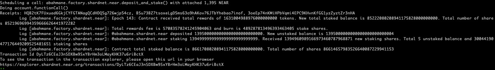
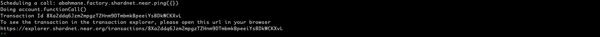
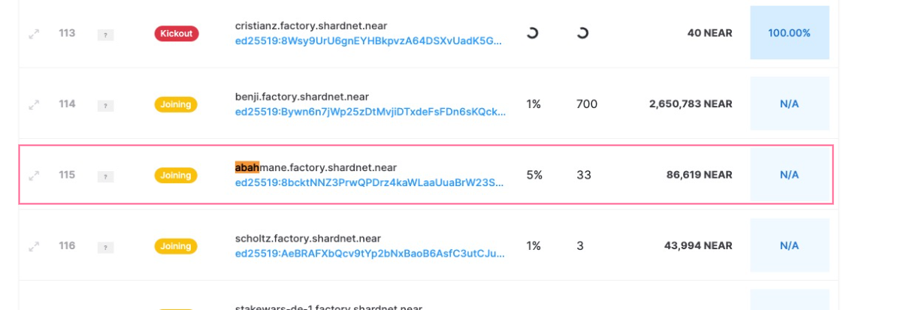
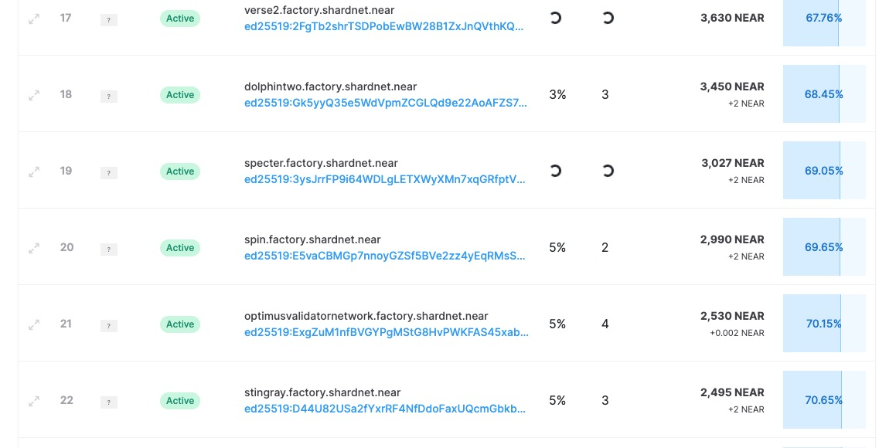
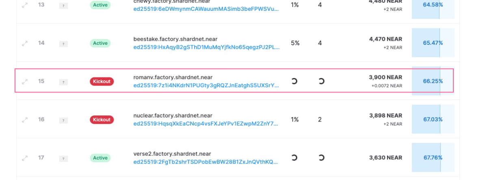

# Configure a staking pool

 ## Deploy a Staking Pool Contract
  
  Create a new staking pool with the specified name, and deploys it to the indicated accountId by calling the staking pool factory

  ```bash
  near call factory.shardnet.near create_staking_pool '{"staking_pool_id": "<pool id>", "owner_id": "<accountId>", "stake_public_key": "<public key>", "reward_fee_fraction": {"numerator": 5, "denominator": 100}, "code_hash":"DD428g9eqLL8fWUxv8QSpVFzyHi1Qd16P8ephYCTmMSZ"}' --accountId="<accountId>" --amount=30 --gas=300000000000000
  ```
  
  replace: 
  
  - **pool id**  with your account-id monikor (ait-belhaj)
  - **accountId** with your complete account-id, ie : ait-belhaj.shardnet.near
  - **public key** with your node public key (the one in file .near/validator_key.json)

 In our case : 

  ```bash
  aitbelhaj@Ubuntu-2004-focal-64-minimal:~/nearcore$ near call factory.shardnet.near create_staking_pool '{"staking_pool_id": "ait-belhaj", "owner_id": "ait-belhaj.shardnet.near", "stake_public_key": "ed25519:xxxxxxxxxxxxxxxxxxxxxxxxxxxxxxxxxxxxxxx", "reward_fee_fraction": {"numerator": 3, "denominator": 100}, "code_hash":"DD428g9eqLL8fWUxv8QSpVFzyHi1Qd16P8ephYCTmMSZ"}' --accountId="ait-belhaj.shardnet.near" --amount=30 --gas=300000000000000
  ```

  if successful, you will see the following output :
  
 
 ```bash
  Scheduling a call: factory.shardnet.near.create_staking_pool({"staking_pool_id": "ait-belhaj", "owner_id": "ait-belhaj.shardnet.near", "stake_public_key":   "ed25519:8bcktN******3SwnVgeYxCkoS", "reward_fee_fraction": {"numerator": 5, "denominator": 100},       
  "code_hash":"DD428g9eqLL8fWUxv8QSpVFzyHi1Qd16P8ephYCTmMSZ"}) with attached 30 NEAR
  Doing account.functionCall()
  Retrying request to broadcast_tx_commit as it has timed out [
         'FgAAAGFiYWhtYW5lLnNoYXJkbmV0Lm5lYXIAz/k+vqUZuujF6VMrG9d8/ROEALCFrU0Rgv09jx6VbyRWudun3AAAABUAAABmYWN0b3J5LnNoYXJkbmV0Lm5lYXLf0ESYW+s5E2lA/vYQUFAMXQPUoGhU  2WG1R56/58ic1QEAAAACEwAAAGNyZWF0ZV9zdGFraW5nX3Bvb2wBAQAAeyJzdGFraW5nX3Bvb2xfaWQiOiJhYmFobWFuZTAxIiwib3duZXJfaWQiOiJhYmFobWFuZS5zaGFyZG5ldC5uZWFyIiwic3Rha2VfcHVibGljX2tleSI6ImVkMjU1MTk6OGJja3ROTlozUHJ3UVBEcno0a2FXTGFhVXVhQnJXMjNTd25WZ2VZeENrb1MiLCJyZXdhcmRfZmVlX2ZyYWN0aW9uIjp7Im51bWVyYXRvciI6NSwiZGVub21pbmF0b3IiOjEwMH0sImNvZGVfaGFzaCI6IkRENDI4ZzllcUxMOGZXVXh2OFFTcFZGenlIaTFRZDE2UDhlcGhZQ1RtTVNaIn0AwG4x2RABAAAAAN7YAzxCv9AYAAAAAAAANuZtlPrrAAeizDFJhhSnOpzBg/6 PRzzoQV9A9HrKUhZPyonmOnV+XD3njxaWn1P8WbC7L1mEgRtzoMQNi+CWAg=='
 ]
 Receipts: 52PBbMqDonX52GDFww2xYRAVbSEcLVQSBqPFGVjMoc2y, 6hGgLYsq5dThGEnqazEYiHQkadxvAANkfpPAYvxxJYKW
	Log [factory.shardnet.near]: The staking pool @ait-belhaj.factory.shardnet.near was successfully created. Whitelisting...
 Transaction Id BUuC6Y6h8Fha6mbsbzvmdynqCNzNxXm9icaps1Tf2JAu
 To see the transaction in the transaction explorer, please open this url in your browser
 https://explorer.shardnet.near.org/transactions/BUuC6Y6h8Fha6mbsbzvmdynqCNzNxXm9icaps1Tf2JAu
 ''
 ```
 

  You have successfully  configured your Staking pool.
  

  ## Deposit and Stake NEAR test tokens


  You can stake to your node by running the following command :

 ```bash
   aitbelhaj@Ubuntu-2004-focal-64-minimal:~/nearcore$ near call ait-belhaj.factory.shardnet.near deposit_and_stake --amount 1395 --accountId ait-belhaj.shardnet.near --gas=300000000000000
 ```
  if the staking transaction is successful , you will see the following output  :

 

 ## Ping

 A Ping should be issued each epoch to keep track of rewards.

 To run a Ping, use the following command:

   ```bash
   aitbelhaj@Ubuntu-2004-focal-64-minimal:~/nearcore$ near call ait-belhaj.factory.shardnet.near ping '{}' --accountId ait-belhaj.shardnet.near --gas=300000000000000
   ```

 
 If the Ping is successful, you will see the following output:

  
 

 
 
 After issuing a Ping,and if it was successful, the node will join the **proposal** list on https://explorer.shardnet.near.org/nodes/validators.
 <br/><br/>

  
 <br/><br/>
 
 In the next Epoch (2h30 in Shardnet), it will enter the **'joining'** list 
  
  <br/><br/>  
  
 <br/><br/>
 
 And finnaly, it join the **active** validators  slot :
  <br/><br/>
  
  <br/><br/>
  
 So it takes at least 2 Epochs after setting up the node to see it in the list of active validators on https://explorer.shardnet.near.org/nodes/validators
 
 
 From time to time,The node may be kicked out for many reason, the most common is when the node did not produce the expected number of blocks.
 
 When the node is kicked out , it's marked as **kickout**.
 
 <br/><br/>
   
 <br/><br/>
 Many reasons could cause the node to be kicked out : 
 
 Network issues, bugs,  power problems ,  etc.. 
 
 
 You may run this command to have more details on the reasons of **slashing**:
 
 ```bash
 
aitbelhaj@Ubuntu-2004-focal-64-minimal:~/nearcore$curl -s -d '{"jsonrpc": "2.0", "method": "validators", "id": "dontcare", "params": [null]}' -H 'Content-Type: application/json' 127.0.0.1:3030 | jq -c '.result.prev_epoch_kickout[] | select(.account_id | contains ("ait-belhaj.factory.shardnet.near"))' | jq .reason
 
 ```
 
 Which will produce :
 
 ```bash
 {
  "NotEnoughBlocks": {
    "expected": 20,
    "produced": 13
  }
}
 ```
 
 This means that the node was kicked out because it has produced only 13 blcocks out of the 20 excpected in that Epoch.
 
 
 You need to Ping the network to become active again. 
 
   
  To avoid node eviction, You can add a crontab job to do a ping every half-epoch:
 
 ```bash
 aitbelhaj@Ubuntu-2004-focal-64-minimal:~/nearcore$ sudo crontab -e
 ```

 ```bash
 0 */1 * * * export NEAR_ENV=shardnet;near call ait-belhaj.factory.shardnet.near ping '{}' --accountId "ait-belhaj.shardnet.near"  --gas=300000000000000
 ```

<br/><br/>

  [Next Step : Node monitoring](https://github.com/abahmanem/near-node-setup-shardnet/blob/main/tutorial/node-monitoring.md)
