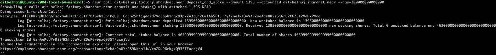
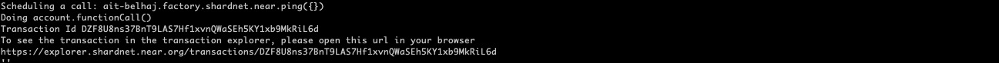
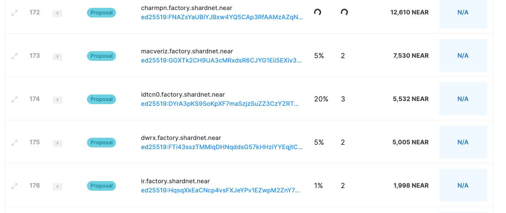
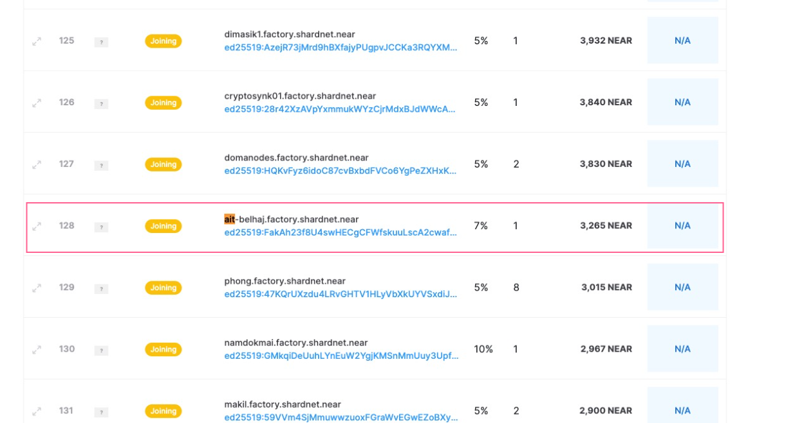

# Configure a staking pool

 ## Deploy a Staking Pool Contract
  
  Create a new staking pool with the specified name, and deploys it to the indicated accountId by calling the staking pool factory

  ```bash
  near call factory.shardnet.near create_staking_pool '{"staking_pool_id": "<pool id>", "owner_id": "<accountId>", "stake_public_key": "<public key>", "reward_fee_fraction": {"numerator": 5, "denominator": 100}, "code_hash":"DD428g9eqLL8fWUxv8QSpVFzyHi1Qd16P8ephYCTmMSZ"}' --accountId="<accountId>" --amount=30 --gas=300000000000000
  ```
  
  replace: 
  
  - **pool id**  with your account-id monikor (abahmane)
  - **accountId** with your complete account-id, ie : abahmane.shardnet.near
  - **public key** with your node public key (the one in file .near/validator_key.json)

 In our case : 

  ```bash
  near call factory.shardnet.near create_staking_pool '{"staking_pool_id": "abahmane", "owner_id": "abahmane.shardnet.near", "stake_public_key": "ed25519:xxxxxxxxxxxxxxxxxxxxxxxxxxxxxxxxxxxxxxx", "reward_fee_fraction": {"numerator": 3, "denominator": 100}, "code_hash":"DD428g9eqLL8fWUxv8QSpVFzyHi1Qd16P8ephYCTmMSZ"}' --accountId="abahmane.shardnet.near" --amount=30 --gas=300000000000000
  ```

  if successful, you will see the following output :
  
 
 ```bash
  Scheduling a call: factory.shardnet.near.create_staking_pool({"staking_pool_id": "abahmane", "owner_id": "abahmane.shardnet.near", "stake_public_key":   "ed25519:8bcktN******3SwnVgeYxCkoS", "reward_fee_fraction": {"numerator": 5, "denominator": 100},       
  "code_hash":"DD428g9eqLL8fWUxv8QSpVFzyHi1Qd16P8ephYCTmMSZ"}) with attached 30 NEAR
  Doing account.functionCall()
  Retrying request to broadcast_tx_commit as it has timed out [
         'FgAAAGFiYWhtYW5lLnNoYXJkbmV0Lm5lYXIAz/k+vqUZuujF6VMrG9d8/ROEALCFrU0Rgv09jx6VbyRWudun3AAAABUAAABmYWN0b3J5LnNoYXJkbmV0Lm5lYXLf0ESYW+s5E2lA/vYQUFAMXQPUoGhU  2WG1R56/58ic1QEAAAACEwAAAGNyZWF0ZV9zdGFraW5nX3Bvb2wBAQAAeyJzdGFraW5nX3Bvb2xfaWQiOiJhYmFobWFuZTAxIiwib3duZXJfaWQiOiJhYmFobWFuZS5zaGFyZG5ldC5uZWFyIiwic3Rha2VfcHVibGljX2tleSI6ImVkMjU1MTk6OGJja3ROTlozUHJ3UVBEcno0a2FXTGFhVXVhQnJXMjNTd25WZ2VZeENrb1MiLCJyZXdhcmRfZmVlX2ZyYWN0aW9uIjp7Im51bWVyYXRvciI6NSwiZGVub21pbmF0b3IiOjEwMH0sImNvZGVfaGFzaCI6IkRENDI4ZzllcUxMOGZXVXh2OFFTcFZGenlIaTFRZDE2UDhlcGhZQ1RtTVNaIn0AwG4x2RABAAAAAN7YAzxCv9AYAAAAAAAANuZtlPrrAAeizDFJhhSnOpzBg/6 PRzzoQV9A9HrKUhZPyonmOnV+XD3njxaWn1P8WbC7L1mEgRtzoMQNi+CWAg=='
 ]
 Receipts: 52PBbMqDonX52GDFww2xYRAVbSEcLVQSBqPFGVjMoc2y, 6hGgLYsq5dThGEnqazEYiHQkadxvAANkfpPAYvxxJYKW
	Log [factory.shardnet.near]: The staking pool @abahmane.factory.shardnet.near was successfully created. Whitelisting...
 Transaction Id BUuC6Y6h8Fha6mbsbzvmdynqCNzNxXm9icaps1Tf2JAu
 To see the transaction in the transaction explorer, please open this url in your browser
 https://explorer.shardnet.near.org/transactions/BUuC6Y6h8Fha6mbsbzvmdynqCNzNxXm9icaps1Tf2JAu
 ''
 ```
 

  You have successfully  configured your Staking pool.
  

  ## Deposit and Stake NEAR test tokens


  You can stake to your node by running the following command :

 ```bash
   abahmane@Ubuntu-2004-focal-64-minimal:~/nearcore$ near call abahmane.factory.shardnet.near deposit_and_stake --amount 1395 --accountId abahmane.shardnet.near --gas=300000000000000
 ```
  if the staking transaction is successful , you will see the following output  :

 

 ## Ping

 A ping should be issued each epoch to keep reported rewards current.

 to run a ping, use the following command:

   ```bash
   abahmane@Ubuntu-2004-focal-64-minimal:~/nearcore$ near call abahmane.factory.shardnet.near ping '{}' --accountId abahmane.shardnet.near --gas=300000000000000
   ```

 
 if the ping is successful, you will see the following output:

  
 
 You can add a crontab job to do a ping every half-epoch (3 hours) :
 
 ```bash
 abahmane@Ubuntu-2004-focal-64-minimal:~/nearcore$ sudo crontab -e
 ```
 
 
 After issuing a ping, the node joins the proposal list on https://explorer.shardnet.near.org/nodes/validators.
 
  
 
 
 In the next Epoch (2h30 in Shardnet), it will enter the **'joining'** list 
  
    
  
 
 
 And finnaly enter the validator **active** slot :
  
  
  
  
 So it take 2 Epochs after setting up the node to see it in the list of active validators on https://explorer.shardnet.near.org/nodes/validators
 
 
 The node may be kiked ou for many reason, the most common when the node did not produced the expected number of blocks. In that case, the node is markec **kickout**.
 
 
   
 
 
 You may issues this command to have more detail on the reasons of kickout:
 
 ```bash
 
abahmane@Ubuntu-2004-focal-64-minimal:~/nearcore$curl -s -d '{"jsonrpc": "2.0", "method": "validators", "id": "dontcare", "params": [null]}' -H 'Content-Type: application/json' 127.0.0.1:3030 | jq -c '.result.prev_epoch_kickout[] | select(.account_id | contains ("abahmane.factory.shardnet.near"))' | jq .reason
 
 ```
 
 Which will produce :
 
 ```bash
 {
  "NotEnoughBlocks": {
    "expected": 117,
    "produced": 73
  }
}
 ```
 
You need to ping the network again to become active again 
 
 
  You can add a crontab job to do a ping every half-epoch (1.5 or 2 hours) :
 
 ```bash
 abahmane@Ubuntu-2004-focal-64-minimal:~/nearcore$ sudo crontab -e
 ```

 ```bash
 0 */1 * * * export NEAR_ENV=shardnet;near call abahmane.factory.shardnet.near ping '{}' --accountId "abahmane.shardnet.near"  --gas=300000000000000
 ```
